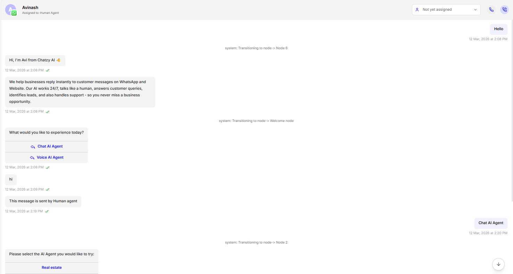
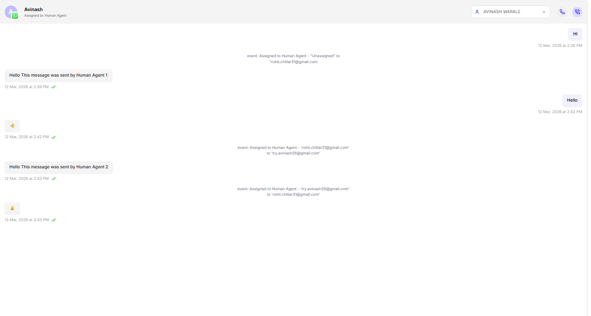
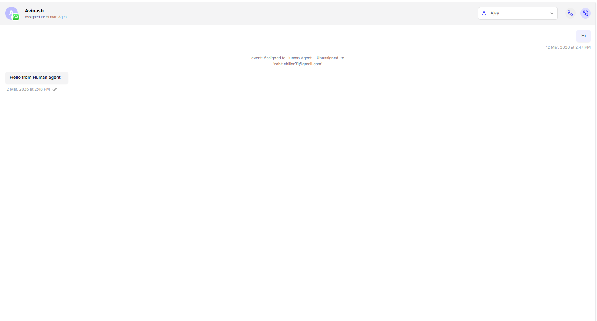

This guide explains how **human agent assignment works in conversations** and what happens when messages are sent in different conversation states.

> A conversation with status **Live** means the **24 hour conversation window** that opens when the user sends a message. During this window, messages can be sent inside the same conversation without using templates.

---

## 1. Conversation is Live and Assigned to AI / Flow

- **Status:** Live  
- **Assigned to:** Conversation AI or Flow

<Frame>
  
</Frame>
**Behavior**

- All messages continue in the **same conversation**.
- A **human agent can send messages** in this conversation.
- The message sent by the human agent **becomes part of the conversation thread**.
- Sending a message **does not transfer control to the human agent**.
- The **AI agent continues the conversation** as defined when the user replies.
- **Human agents cannot take assignment** of the conversation in this state.

---

## 2. Conversation is Live and Assigned to a Human Agent

- **Status:** Live  
- **Assigned to:** A specific human agent

<Frame>
  
</Frame>
**Behavior**

- Messages continue in the **same conversation**.
- If the **same agent** sends a message, the assignment **remains unchanged**.
- If a **different agent** sends a message, the conversation **automatically gets reassigned** to that agent.

---

## 3. Conversation is Live but Unassigned

- **Status:** Live  
- **Assigned to:** Human agent (Unassigned)

<Frame>
  
</Frame>

**Behavior**

- Messages continue in the **same conversation**.
- The **first agent who sends a message** becomes the assigned agent for that conversation.

---

## 4. Conversation is Closed, Abandoned, or Template

- **Status:** Conversation is Closed, Abandoned, or sent Template by campaign but **24 hrs conversation window is open.**

**Behavior**

- A **new conversation is created** when a message is sent.
- The new conversation is **assigned to the human agent whose email is used to send the message**.