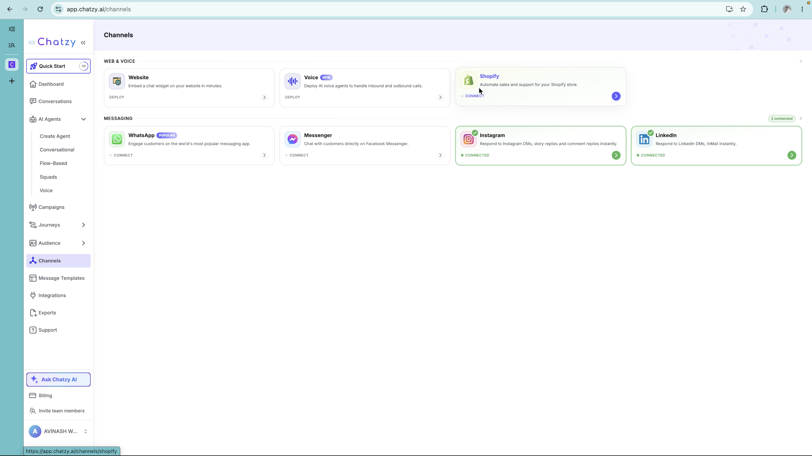
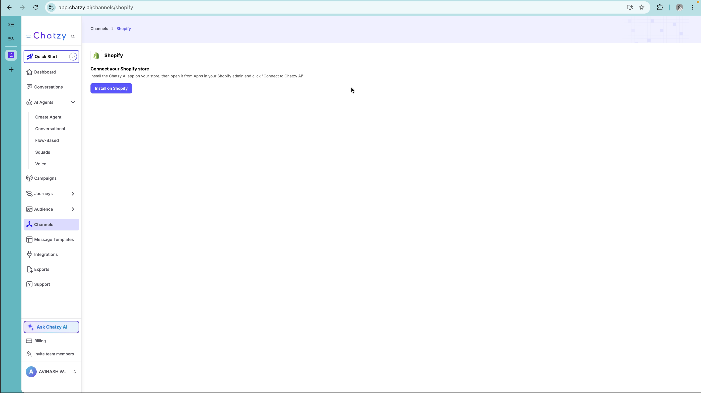
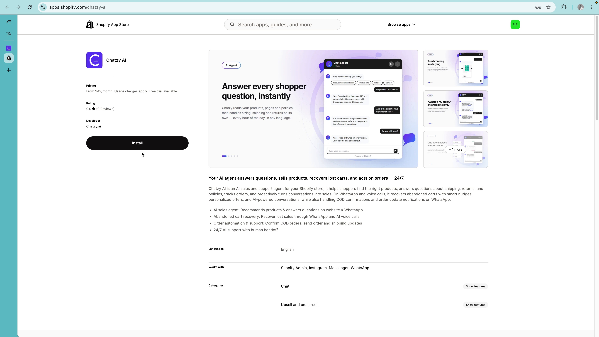
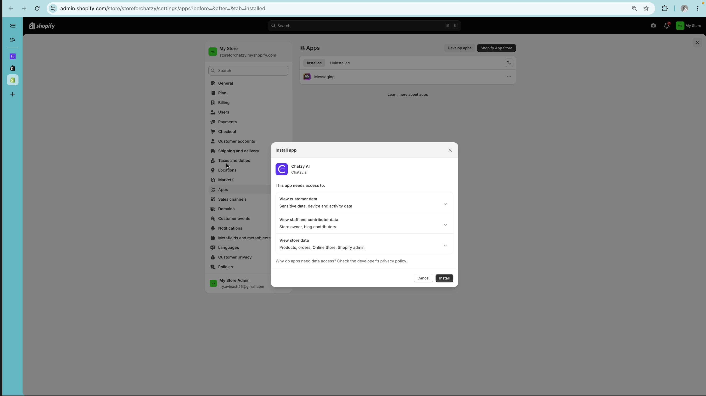
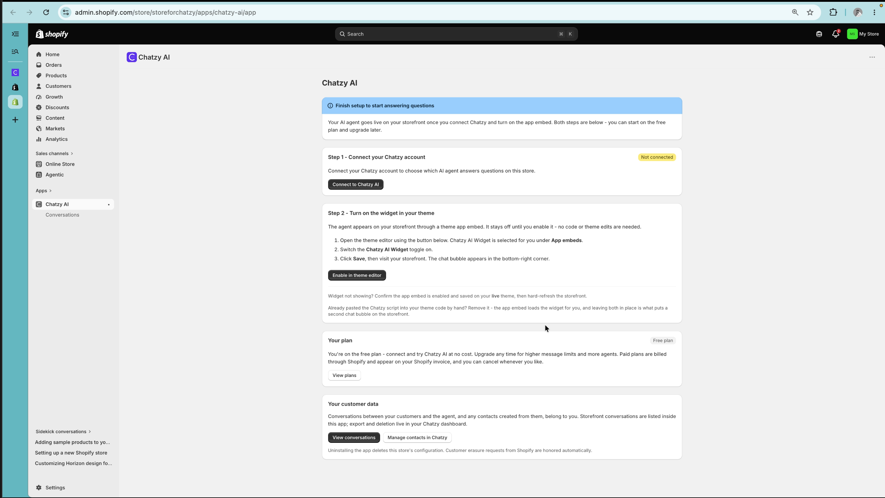
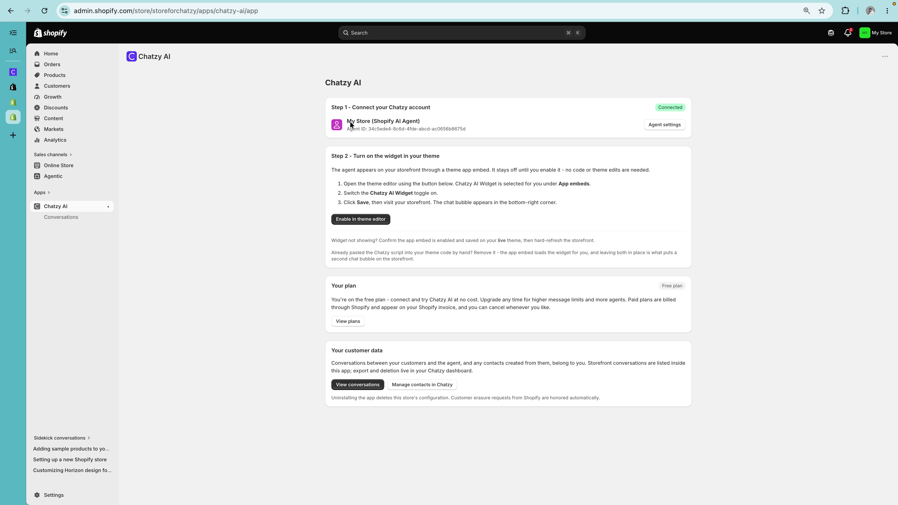
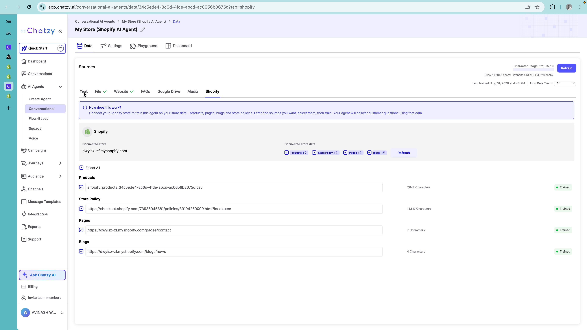
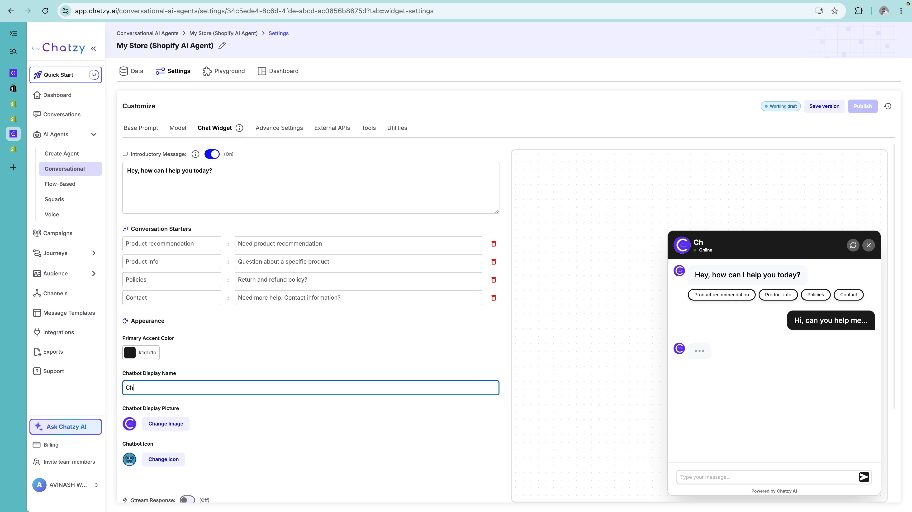
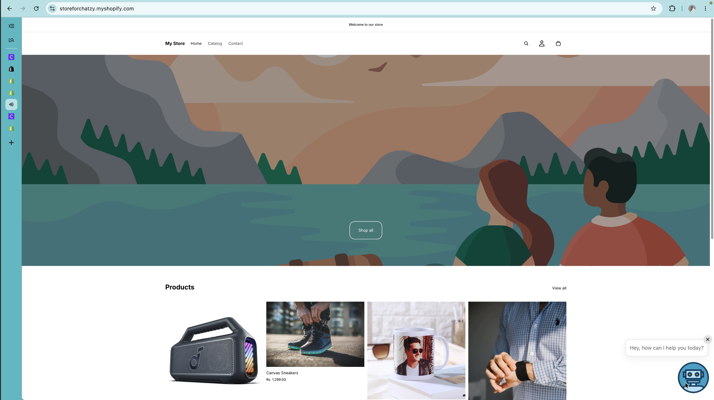
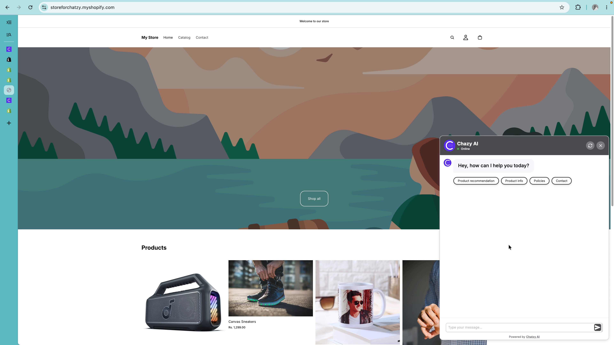

A step-by-step guide for connecting a Shopify store with a Chatzy AI and assign conversational AI agent, enabling the storefront widget, training the agent on Shopify data, and verifying product recommendations.

## Prerequisites

Before starting, make sure you have:

- An active **Shopify store**.
- Access to your **Shopify Admin**.
- Products and relevant store information available in Shopify.

---

## 1. Install Chatzy AI from the Shopify App Store

Start by connecting Shopify from your Chatzy AI dashboard.

Go to:

**Channels → Shopify**

<Frame>
  
</Frame>

Click **Install on Shopify**.

<Frame>
  
</Frame>

You will be redirected to the **Chatzy AI** app listing in the Shopify App Store.

Click **Install** to add Chatzy AI to your Shopify store.

<Frame>
  
</Frame>

Shopify will display a confirmation screen showing the permissions required by the app.


<Frame>
  
</Frame>

Review the permissions and click **Install**.

Once the installation is complete, Shopify will open the Chatzy AI app inside your Shopify Admin.

---

## 2. Connect Your Chatzy AI Account

After installing the app, you will see the Chatzy AI setup page inside Shopify.

This page guides you through connecting your Chatzy account and enabling the AI assistant on your storefront.

<Frame>
  
</Frame>

### Connect to Chatzy AI

Click **Connect to Chatzy AI**.

This will connect your Shopify store to Chatzy and automatically create a dedicated **Conversational AI Agent** for your store.

Once the connection is complete, you will see the connected store and agent details.

<Frame>
  
</Frame>

> **Note:** The AI agent created for your Shopify store can be customized from your Chatzy AI dashboard.

---

## 3. Enable the Chatzy Widget

Once your Shopify store is connected, enable the Chatzy AI widget on your storefront.

From the Chatzy AI setup page, click **Enable in theme editor**.

This opens the **Shopify Theme Editor** for your active theme and automatically adds the Chatzy AI widget.

From the Theme Editor, you can:

- Change the widget's position.
- Adjust other available theme settings.
- Preview how the widget looks on your storefront.

Once you are happy with the changes, click **Save**.

> **Important:** Make sure you save the Theme Editor changes. The widget will not appear on your storefront until the changes are saved.

---

## 4. Customize Your AI Agent

After connecting your Shopify store, you can customize the AI agent from Chatzy.

From the Shopify setup page, click **Agent Settings**.

This will open the corresponding AI agent in your Chatzy AI dashboard.

### Sync Shopify Data

Go to:

**Agent → Data → Shopify**

Chatzy automatically fetches relevant information from your Shopify store.

This can include:

- **Products**
- **Store Policies**
- **Pages**
- Other supported Shopify content

<Frame>
  
</Frame>

You can add additional data sources if your AI agent needs more information to answer customer questions.

> **Tip:** Keep your Shopify data and additional knowledge sources up to date so the AI agent can provide accurate answers.

---

## 5. Customize the Chat Widget

You can customize how the AI assistant appears and behaves on your Shopify storefront.

Open the AI agent and go to:

**Settings → Chat Widget**

<Frame>
  
</Frame>

### Introductory Message

Set the message customers see when they first open the chat.

For example:

```text
Hey, how can I help you today?
```

### Conversation Starters

Add quick actions that help customers start a conversation.

Some useful examples include:

- **Find a product**
- **Get product recommendations**
- **Product information**
- **Shipping & policies**

### Appearance

Customize the widget to match your Shopify storefront branding.

Depending on the available settings, you can customize elements such as:

- Primary accent color
- Chatbot display name
- Chatbot profile picture
- Widget icon

> ###  To learn more about AI Agent customization, check out our [AI Agent Customization playlist](https://youtube.com/playlist?list=PLNnPOTSvzPMMuxSHH_xDJtUxDLTza3A8z&si=XaBYhlLLoJj0iXu_) for detailed instructions.

---
## 6. Verify the Widget on Your Storefront

After saving the Theme Editor changes, open your Shopify storefront.

The **Chatzy AI chat widget** should now be visible on your storefront.

<Frame>
  
</Frame>

Open the widget and send a test message to make sure the AI agent is responding correctly.

---

## 7. Test Product Recommendations

The AI agent can use your Shopify product data to answer product-related questions and provide recommendations.

Try asking natural-language questions such as:

```text
Show me some hoodies.
```

```text
I need a gift for my brother.
```

```text
What stationery products do you have?
```

```text
Which products would you recommend for a budget of ₹2000?
```

<Frame>
  
</Frame>

Test different types of queries to make sure the agent understands your customers' typical shopping requests.

---

## 8. Troubleshooting

### The widget is not visible

If the Chatzy widget does not appear on your storefront, check the following:

1. Open **Shopify Theme Editor → App embeds**.
2. Make sure the **Chatzy AI Widget** is enabled.
3. Confirm that your Theme Editor changes have been saved.
4. Make sure you are viewing the storefront associated with the active theme.
5. Refresh the storefront after enabling the widget.

### Duplicate chat bubbles appear

If you previously added the Chatzy widget manually to your Shopify theme, you may see two chat bubbles.

Remove the old/manual widget implementation and use the Shopify app embed instead.

> **Important:** Do not load the Chatzy widget through both the manual script and Shopify app embed.

### Products are not being recommended

Open the AI agent in Chatzy AI and go to the **Shopify** data source.

Verify that:

- Your Shopify store is connected.
- **Products** are available as a data source.
- The product data has been successfully processed.

If you make changes to your Shopify data or data sources, allow the agent to process the updated information before testing again.

### Policy or page information is missing

If the agent cannot answer questions about shipping, returns, or other store information, check whether the relevant Shopify sources are available.

Depending on your setup, this may include:

- **Store Policies**
- **Pages**
- **Blogs**

Add the required sources and make sure the agent has processed the updated data.

---

## You're Ready! 🎉

Your Shopify store is now connected to Chatzy AI.

Your AI assistant can help shoppers **discover products, answer questions, provide recommendations, and navigate your store** directly from the storefront.
